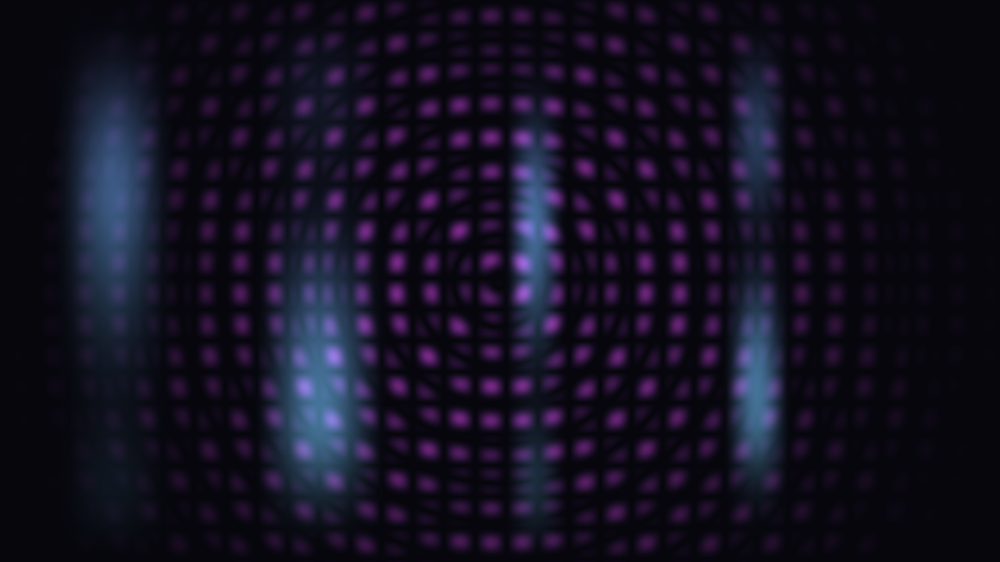

# CBL — Creative Bowl Lab

A live installation built around a Tibetan singing bowl. A person stands in front of a webcam;
the bowl's sound physically alters their heartbeat (read by an Arduino pulse sensor), and
**TouchDesigner renders a living-art installation around them** — a body aura that pulses with
each heartbeat (colour encodes BPM), flowing colour, a cymatics / Chladni interference figure
shaped by the bowl's pitch, aurora ribbons, and chakra colour drawn from the bowl frequency
(396–963 Hz Solfeggio scale).

TU/e Multi-Disciplinary CBL course, Group 5, Year 2 Q4 2025–2026. Final presentation: **19 June 2026**.

The whole show runs **standalone on one laptop + one webcam — no browser.**

## What it looks like



More frames: [`cymatics`](docs/td-screenshots/cymatics.png) ·
[`aurora`](docs/td-screenshots/aurora.png) ·
[`p_render`](docs/td-screenshots/p_render.png).

## Repo structure

```text
.
├── td/                     # ★ THE INSTALLATION — TouchDesigner network cbl.toe
│                           #   + its Python / GLSL / bundled MediaPipe models. This is the demo.
│                           #   Paths are hardcoded to C:/projects/CBL/td, so td/ never moves.
├── docs/                   # Current, authoritative docs
│   ├── index.md            #   doc index
│   ├── td-screenshots/     #   installation screenshots
│   ├── teammate-handoff/   #   teammate package
│   └── archive/            #   superseded specs / old plans / meeting notes
├── legacy/web/             # DORMANT secondary React/Vite web app — reversible fallback, NOT the demo
├── presentation/           # Final-presentation deck
├── EngineeringArt CBL/     # Teammate MATLAB / CSV source contributions
├── README.md
├── CLAUDE.md
└── RUN.md
```

## Run it

On a machine with TouchDesigner installed and the webcam connected:

```powershell
& "C:\Program Files\Derivative\TouchDesigner\bin\TouchDesigner.exe" "C:\projects\CBL\td\cbl.toe"
```

Stand in front of the webcam — **no browser**. TouchDesigner does the camera, body/hand
tracking, particles, aura, cymatics, aurora, and chakra audio on the GPU, from a single laptop.

**Full run + tuning instructions (bowl-mic / heartbeat enable steps, tuning knobs): see
[`RUN.md`](RUN.md).**

## Docs

- [`docs/index.md`](docs/index.md) — the documentation index.
- [`docs/touchdesigner-onesurface-2026-05-27.md`](docs/touchdesigner-onesurface-2026-05-27.md)
  — **START HERE.** The authoritative standalone architecture.

## Note

`legacy/web/` is a dormant React/Vite web app kept only as a reversible fallback dev tool.
It is not launched at the demo, and the installation does not depend on it.
